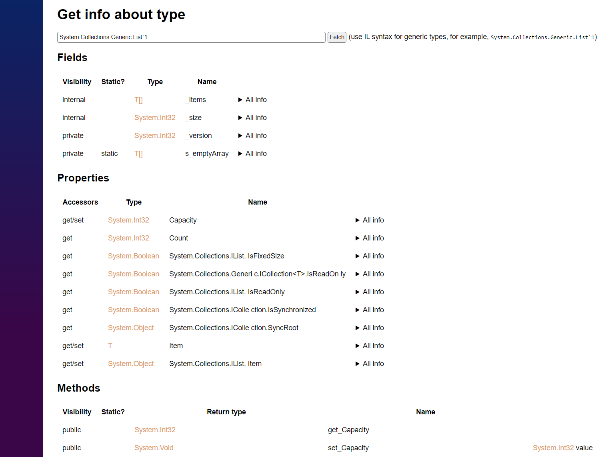

## TypeInfo

This is a small web app to analyze all information about a type presented in BCL.
To use the service, go to [https://whiteblackgoose.github.io/TypeInfo/](https://whiteblackgoose.github.io/TypeInfo/)
and pass a type you want to analyze in there.

It is powered by Blazor WASM + Github pages + .NET 6. To set up your own app the
same way, you can read a short instruction ([EN](https://swimburger.net/blog/dotnet/how-to-deploy-aspnet-blazor-webassembly-to-github-pages) | [RU](https://habr.com/ru/post/566286/))